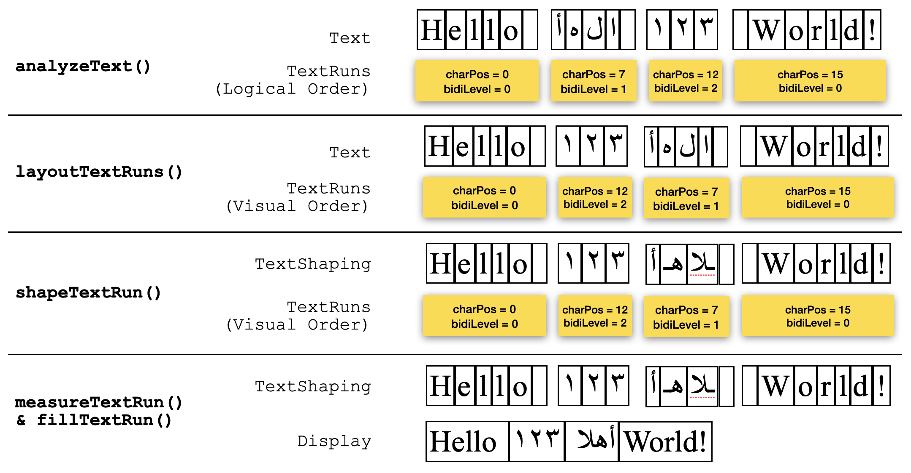
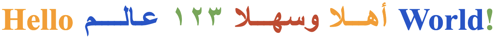
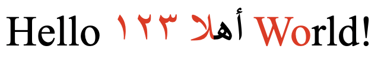
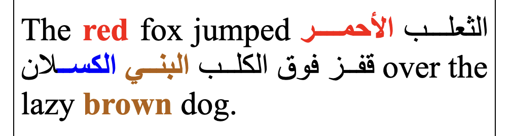

# Canvas Text Shaping

HTML canvas currently offers only limited text support. As 2D canvas is increasingly used for complex text scenarios—such as word processors—robust complex text support has become essential.

Other alternatives, like combining HTML-in-Canvas with SVG, fall short for sophisticated use cases. HTML-in-Canvas can render complex scripts flawlessly, but it lacks fundamental text-processing capabilities such as caret positioning, hit-testing, and computing selection rectangles. Building a text-on-path editor like the one in this [demo](https://demos.skia.org/demo/canvas_edit/) page is best achieved through the `HTMLCanvasElement` API—but doing so requires adding text shaping support to `CanvasText`.

## Text Processing Main Functionalities 

These are the core capabilities an editor or word processor's interactive UI needs to provide for text editing:

1. Displaying (e.g. fillText() and strokeText())
2. Measuring (e.g. measureText())
3. Segmentation (line breaking, RTL direction, styles, clusters, etc…)
4. Hit testing
5. Caret positioning
6. Selection rectangles
7. Justification

## API purpose

Extend the capabilities of `CanvasRenderingContext2D` to support text shaping and layout. This would additionally enable precise caret positioning, hit testing and text selection rectangles calculations.

## Summary of the Google proposal

Google has put forward a [proposal](https://github.com/fserb/canvas2D/blob/master/spec/enhanced-textmetrics.md) that targets a single, focused problem: computing [grapheme cluster boundaries](https://www.unicode.org/reports/tr29/#Grapheme_Cluster_Boundaries). These boundaries would then be honored consistently across display, hit-testing, caret positioning, and selection rectangle calculations—enabling clusters to be drawn in isolation.

The proposal works by extending `TextMetrics` with the ability to compute text clusters. Each cluster internally holds—without exposing—its text, glyphs, advance, and font. 

This is how their API would support drawing text one cluster at a time.

```
const tm = ctx.measureText(text);
const clusters = tm.getTextClusters();
const colors = ['orange', 'navy', 'teal', 'crimson'];

for(let [index, cluster] of clusters) {
    ctx.fillStyle = colors[index % colors.length];
    ctx.fillTextCluster(cluster, 0, 0);
}
```

## Problems with the Google proposal 

This proposal solves a single problem and gives no indication of how it might be extended going forward. Our assessment raises the following concerns:


1. **Not extensible**. Everything happens in a single step via `getTextClusters()`, using whatever style is currently selected. Clients have no opportunity to intervene before shaping to achieve, for example, custom rendering.
2. **No support for rich text**. The proposal doesn't handle text where multiple fonts or colors are applied within a single line.
3. **Extends the wrong object**. It extends `TextMetrics` and has it own both the text and its shaping information. Today, `TextMetrics` simply returns the geometry of measured text—we believe `CanvasText` is the more appropriate place to add text-shaping support. Extending `CanvasText` allows multi-styled text to be processed.
4. **Inefficient for uniform styling**. Even when text shares the same font and color throughout, the client is still forced to render it cluster by cluster.

## WebKit proposal

This proposal offers multiple levels of text shaping, letting the client work with a `DOMString`, `TextRun`, `GlyphRun` or `GlyphRuns` depending on their needs. It also allows the client to adjust style before the actual text-shaping step occurs, which keeps the interface simple while remaining extensible. It covers most text-shaping functionality, and while most of this is straightforward to implement, a handful of features require support from system frameworks.

`IIntl.Segmenter` will be extended to handle text segmentation and layout. Neither depends on which font is selected in the canvas context—both rely solely on the Unicode code points of the text.

## Intl.Segmenter changes

A set of APIs is needed to analyze text and break it into `TextRuns`. A `TextRun` is a substring of the text that has a single script, direction, and layout. The information stored in `TextRuns` is then used to determine their visual order—for bidirectional (BiDi) languages, the visual order in which TextRuns are displayed can differ from their logical (memory) order. We believe `Intl.Segmenter` is the best place to add these new APIs.

**TextRun:** `analyzeText()` breaks the text down into a series of *runs* based on changes in the required text engine or in text direction. Each such subdivision is represented by a `TextRun`, and `analyzeText()` returns a sequence of `TextRuns`.

```
interface TextRun {
    readonly attribute unsigned long start;
    readonly attribute DOMString text;
};

Intl.Segmenter.breakText(string)
// Return the indices of the breaking opportunities

Intl.Segmenter.analyzeText(string** ** [, sequence<unsigned long>, options])
// Second and third parameters are optional. The second paramter can be used
// to apply custom slicing.
// Return an array of TextRuns

Intl.Segmenter.layoutTextRuns(textRuns)
// Return the the visual order to display TextRuns
```

## IDL changes

Placing the shaping functions in `TextMetrics` would not allow selecting multiple fonts for different `TextRuns` within the same line. Placing them in `CanvasText` instead allows a font to be selected before the shaping APIs are called. The result of shaping a `TextRun` is called a `GlyphRun`.

**GlyphRun**: Using the currently selected font, `shapeTextRun()` applies contextual shaping, ligatures, and character-to-glyph translation as required for complex scripts (such as Arabic, Hebrew, or Indic languages). `shapeTextRun()` returns a `GlyphRun`, which can be used directly—bypassing the shaping step—when processing the text.

The IDL changes below fall into four categories:

1. Text APIs
2. TextRun shaping
3. GlyphRun drawing
4. sequence<GlyphRun> APIs

```
interface GlyphRun {
    readonly attribute TextRun textRun;

    // Returns an array of clusters.
    sequence<GlyphRun> split();

    TextMetrics textMetrics();
    unsigned long advanceToPosition(double advance);
    double positionToAdvance(unsigned long position);
    DOMRectReadOnly selectionRect(unsigned long start, unsigned long end);
};

callback StyleCallback = undefined (TextRun textRun);

interface mixin CanvasText {
    // ... extended from current CanvasText.

    // ---------------------------------------------------------
    // Text APIs
    // ---------------------------------------------------------
    // Text analysis - `segments` is used to apply custom slicing
    sequence<GlyphRun> shapeText(DOMString text, optional sequence<unsigned long> segments, optional StyleCallback? styleCallback);
    // Text clusters - returns an array of GlyphRuns; each GlyphRun represents a cluster
    sequence<GlyphRun> splitText(DOMString text, optional StyleCallback? styleCallback);
    // Text wrapping - returns an array of arrays of GlyphRuns. Each array has the GlyphRuns in the visual order
    sequence<sequence<GlyphRun>> wrapText(DOMString text, double wrapWidth, optional sequence<unsigned long> segments, optional StyleCallback? styleCallback);
    // Text drawing
    undefined fillText(DOMString text, double x, double y, optional sequence<unsigned long> segments, optional StyleCallback? styleCallback);
    undefined strokeText(DOMString text, double x, double y, optional sequence<unsigned long> segments, optional StyleCallback? styleCallback);
    // Text geomtery
    unsigned long textAdvanceToPosition(DOMString text, double advance, optional sequence<unsigned long> segments, optional StyleCallback? styleCallback);
    double textPositionToAdvance(DOMString text, unsigned long position, optional sequence<unsigned long> segments, optional StyleCallback? styleCallback);
    sequence<DOMRectReadOnly> textSelectionRects(DOMString text, unsigned long start, unsigned long end, optional sequence<unsigned long> segments, optional StyleCallback? styleCallback);

    // ---------------------------------------------------------
    // TextRun shaping
    // ---------------------------------------------------------
    GlyphRun shapeTextRun(TextRun run);

    // ---------------------------------------------------------
    // GlyphRun drawing
    // ---------------------------------------------------------
    double fillGlyphRun(GlyphRun run, double x, double y);
    double strokeGlyphRun(GlyphRun run, double x, double y);
    
    // ---------------------------------------------------------
    // GlyphRuns APIs
    // ---------------------------------------------------------
    // GlyphRuns drawing
    undefined fillGlyphRuns(sequence<GlyphRun> glyphRuns, double x, double y, optional StyleCallback? styleCallback);
    undefined strokeGlyphRuns(sequence<GlyphRun> glyphRuns, double x, double y, optional StyleCallback? styleCallback); 
    // GlyphRuns justification
    sequence<GlyphRun> justifyGlyphRuns(sequence<GlyphRun> glyphRuns, double width);
    // GlyphRuns  geometry.
    unsigned long glyphRunsAdvanceToPosition(sequence<GlyphRun> glyphRuns, double advance);
    double glyphRunsPositionToAdvance(sequence<GlyphRun> glyphRuns, unsigned long position);
    sequence<DOMRectReadOnly> glyphRunsSelectionRects(sequence<GlyphRun> glyphRuns, unsigned long start, unsigned long end);
}
```

## Polyfills

This section outlines a set of polyfills. Their purpose is to demonstrate the proposal in action and to show its extensibility and how it can be integrated. Implementing them in C++ would be more efficient.

### Shaping Text

This polyfill shows how `shapeText()` API can be implemented using the proposed shaping APIs. `shapeText()` takes a `DOMString`. It breaks it into `TextRuns` and calls `shapeTextRun()` for each one of them in their visual order. It returns an array of `GlyphRuns`.

```
CanvasText.prototype.shapeText = function(text, segments, styleCallback)
{
    const textRuns = Intl.Segmenter.analyzeText(text, segments);
    const visualOrder = Intl.Segmenter.layoutTextRuns(textRuns);
    return visualOrder.map((index) => {
        styleCallback?.(textRuns[index]);
        return this.shapeTextRun(textRuns[index]);
    });
}
```

### Text Splitting

This polyfill shows how `splitText()` API can be implemented using the proposed shaping APIs. `splitText()` takes a `DOMString` and `styleCallback`. It shapes the string by calling `shapeText()` which returns an array `GlyphRuns`. For each `GlyphRuns`, we get its clusters by calling `GlyphRun.split()` which returns an array of `GlyphRuns` . Flatting these arrays will return an array of `GlyphRuns` which represents the clusters of the text.

```
CanvasText.prototype.splitText = function(text, styleCallback)
{
    const glyphRuns = ctx.shapeText(text, { }, styleCallback);
    return glyphRuns.map(glyphRun => glyphRun.split()).flat();
}
```

### Text Wrapping

This polyfill shows how `wrapText()` API can be implemented using the proposed shaping APIs. `wrapText()` finds the breaking opportunities in a `DOMString` based on the `wrapWidth` . It collects each line in an array of `GlyphRuns`. So it returns an array of arrays of `GlyphRuns`.

```
class WordIterator {
    textRuns;
    breaks;
    styleCallback;
    runIndex = 0;
    breakIndex = 0;

    constructor(textRuns, breaks, styleCallback) {
        this.textRuns = textRuns;
        this.breaks = breaks;
        this.styleCallback = styleCallback;
    }

    isEndOfText() {
        return this.runIndex >= this.textRuns.length;
    }

    nextWord(ctx) {
        if (this.isEndOfText())
            return null;

        const wordGlyphRuns = [];
        let wordWidth = 0;

        for (; this.runIndex < this.textRuns.length; ++this.runIndex) {
            const textRun = this.textRuns[this.runIndex];
            if (textRun.start >= this.breaks[this.breakIndex])
                break;

            this.styleCallback?.(textRun);
            const glyphRun = ctx.shapeTextRun(textRun);
            wordGlyphRuns[wordGlyphRuns.length] = glyphRun;
            wordWidth += glyphRun.textMetrics().width;
        }

        ++this.breakIndex;
        return { glyphRuns: wordGlyphRuns, width: wordWidth };
    }
}

class LineIterator {
    wordIterator;
    wrapWidth;
    breakRecord = null;

    constructor(textRuns, breaks, wrapWidth, styleCallback) {
        this.wordIterator = new WordIterator(textRuns, breaks, styleCallback);
        this.wrapWidth = wrapWidth;
    }

    nextLine(ctx) {
        if (this.wordIterator.isEndOfText())
            return null;

        let lineGlyphRuns = [];
        let lineWidth = 0;

        if (this.breakRecord) {
            lineGlyphRuns = this.breakRecord.word.glyphRuns;
            lineWidth = this.breakRecord.word.width;
            this.breakRecord = null;
        }

        let word = this.wordIterator.nextWord(ctx);
        while (word) {
            if (lineWidth + word.width > this.wrapWidth) {
                this.breakRecord = { word: word };
                return lineGlyphRuns;
            }

            lineGlyphRuns = lineGlyphRuns.concat(word.glyphRuns);
            lineWidth += word.width;
            word = this.wordIterator.nextWord(ctx);
        }

        return lineGlyphRuns;
    }
};

CanvasText.prototype.wrapText = function(text, segments, wrapWidth, styleCallback)
{
    const breaks = Intl.Segmenter.breakText(text);
    const allBreaks = segments.concat(breaks).sort((a, b) => a - b);
    const textRuns = Intl.Segmenter.analyzeText(text, allBreaks);

    const lines = [];
    const lineIterator = new LineIterator(textRuns, breaks, wrapWidth, styleCallback);

    let lineGlyphRuns = lineIterator.nextLine(this);
    while (lineGlyphRuns) {
        const lineTextRuns = lineGlyphRuns.map(glyphRun => glyphRun.textRun);
        const visualOrder = this.layoutTextRuns(lineTextRuns);
        lines[lines.length] = visualOrder.map(index => lineGlyphRuns[index]);
        lineGlyphRuns = lineIterator.nextLine(this);
    }

    return lines;
}
```

### Drawing Text

This polyfill shows how the existing `fillText()` API can be implemented using the proposed shaping APIs. First the text is shaped after `styleCallback`  is called . The resulting `GlyphRuns` are displayed in their visual order via `fillGlyphRun()` .

```
CanvasText.prototype.fillGlyphRuns = function(glyphRuns, x, y, styleCallback)
{
    for (`const`` `glyphRun of glyphRuns) {
        styleCallback?.(glyphRun.textRun);
        x += this.fillGlyphRun(glyphRun, x, y);
    }
}

CanvasText.prototype.fillText = function(text, x, y, segments, styleCallback)
{
    const glyphRuns = this.shapeText(text, segments, styleCallback);
    this.fillGlyphRuns(glyphRuns, x, y, styleCallback);
}
```

This diagram below shows how the text **Hello أهلا ١٢٣ World!** is processed for displayed:

### Hit Testing

This polyfill shows how the `textAdvanceToPosition()` API can be implemented using the proposed shaping APIs. The text is first shaped after `styleCallback` is called, and the resulting `GlyphRuns` are then processed in their visual order. Once a `GlyphRun` containing the target advance is found, `advanceToPosition()` is called on that `GlyphRun` with the relative advance. The position returned, relative to the beginning of the text, is the hit-testing result.

```
CanvasText.prototype.glyphRunsAdvanceToPosition = function(glyphRuns, advance)
{
    for (const glyphRun of glyphRuns) {
        const width = glyphRun.textMatrics().width;
        if (advance < width)
            return glyphRun.textRun.start + glyphRun.advanceToPosition(advance);
        advance -= width;
    }
}

CanvasText.prototype.textAdvanceToPosition = function(text, advance, segments, styleCallback)
{
    const glyphRuns = this.shapeText(text, segments, styleCallback);
    return this.glyphRunsAdvanceToPosition(glyphRuns, advance);
}
```

### Caret Positioning

This polyfill shows how the `textPositionToAdvance()` API can be implemented using the proposed shaping APIs. The text is first shaped after `styleCallback` is called, and the resulting `GlyphRuns` are then processed in their visual order. Once a `GlyphRun` containing the target position is found, `positionToAdvance()` is called on that `GlyphRun` with the relative position. The advance returned, relative to the beginning of the line, is the caret-position result.

```
CanvasText.prototype.glyphRunsPositionToAdvance = function(textRuns, glyphRuns, position)
{
    let advance = 0;

    for (const glyphRun of glyphRuns) {
        const width = glyphRun.textMatrics().width;
        const runStart = glyphRun.textRun.start;
        const runEnd = runStart + glyphRun.textRun.text.length;

        if (position >= runStart && position < runEnd)
            return advance + glyphRun.positionToAdvance(position - runStart);
        advance += width;
    }

    return advance;
}

CanvasText.prototype.textPositionToAdvance = function(text, position, segments, styleCallback)
{
    const glyphRuns = this.shapeText(text, segments, styleCallback);
    return this.glyphRunsPositionToAdvance(glyphRuns, position);
}
```

### Selection Rects

This polyfill shows how the `textSelectionRects()` API can be implemented using the proposed shaping APIs. The text is first shaped after `styleCallback` is called, and the resulting `GlyphRuns` are then processed in their visual order. For each `GlyphRun` that intersects the selection range, the rectangle of that intersection is computed. This rectangle is then merged with the previously calculated one if they're horizontally adjacent; otherwise, it's appended as a new rectangle.

```
CanvasText.prototype.glyphRunsSelectionRects = function(glyphRuns, start, end)
{
    const rects = [];

    for (const glyphRun of glyphRuns) {
        const runStart = glyphRun.textRun.start;
        const runEnd = runStart + glyphRun.textRun.text.length;

        // Intersect [start, end] with TextRun range
        const rangeStart = Math.max(runStart, start);
        const rangeEnd = Math.min(runEnd, end);
        if (rangeStart >= rangeEnd)
            continue;

        const rect = glyphRun.selectionRect(rangeStart, rangeEnd);

        // Try to combine the new rect with the last rect.
        // Otherwise add a new rect.
        if (rects.length && rects[rects.length - 1].right == rect.left)
            rects[rects.length - 1].right = rect.right;
        else
            rects[rects.length] = DOMRect.fromRect(rect);
    }

    return rects;
}

CanvasText.prototype.textSelectionRects = function(text, start, end, segments, styleCallback)
{
    const glyphRuns = this.shapeText(text, segments, styleCallback);
    return this.glyphRunsSelectionRects(glyphRuns, start, end);
}
```

## Examples

These examples are for demo purposes. Their main goal is to show how simple and elegant the code can be while still handling complex scenarios. The `GlyphRuns` are intentionally retrieved as a separate step before being displayed, to highlight an opportunity for caching them. Cached `GlyphRuns` can be used with any of the text geometry functions.

### Example 1: Drawing Colored Clusters

This example shows how Google's [proposal](https://github.com/fserb/canvas2D/blob/master/spec/enhanced-textmetrics.md) can be implemented using the proposed shaping APIs. The text is split into clusters using the same selected font, with each cluster returned as a `GlyphRun`. `fillGlyphRuns()` is then called, with a custom  `styleCallback` to change the text color for each cluster.

```
// Google example
function fillClustersWithColors(ctx, text, x, y, colors)
{
    const clusters = ctx.splitText(text);
    ctx.fillGlyphRuns(clusters, x, y, (textRun) => {
        // This will color each cluster differently.
        ctx.fillStyle = colors[textRun.start % colors.length];
    });
}
```

This method can be called like this

```
ctx.font = '60px serif';
ctx.textAlign = 'left';
ctx.textBaseline = 'middle';

const text = 'Colors 🎨 are 🏎️ fine!';
const colors = ['orange', 'navy', 'teal', 'crimson'];
fillClustersWithColors(ctx, text, 0, 0, colors);
```

The result should look like this. Notice that the emojis, as well as the letters "f" and "i", are each rendered as a single glyph and treated as a single cluster.

### Example 2: Drawing Justified Colored Words

This example shows how a line of text can be displayed justified, with each word styled in a different color. First, the word boundaries in the text are calculated by calling `Intl.Segmenter.breakText()`. The text is then shaped, with the word boundaries enforced by passing them to `shapeText()`. The resulting `GlyphRuns` are justified, and each one is displayed after changing the text color.

```
// Drawing justified colored words
function fillJustifiedColoredWords(ctx, text, x, y, lineWidth, colors)
{
    // Enforce word boundaries segmentation.
    const segments = Intl.Segmenter.breakText(text);
    const glyphRuns = this.shapeText(text, segments);
    const justifiedGlyphRuns = ctx.justifyGlyphRuns(glyphRuns, lineWidth);

    let index = 0;
    this.fillGlyphRuns(justifiedGlyphRuns, x, y, (textRun) => {
        // This will color each word differently.
        ctx.fillStyle = colors[index++ % colors.length];
    });
}
```

This method can be called like this

```
const text = 'Hello أهلا وسهلا ١٢٣ عالم World!';
const colors = ['orange', 'navy', 'teal', 'crimson'];
fillJustifiedColoredWords(ctx, text, 0, 0, 500, colors);
```

The result of using this function can be something like this screenshot

### Example 3: Drawing Styled Text

This example shows how a multi-style line can be displayed using the proposed shaping APIs. First, the style boundaries in the text are calculated. The text is then shaped, with the style boundaries enforced by passing them to `shapeText()`. The resulting `GlyphRuns` are displayed, ensuring the text color is changed accordingly for each `GlyphRun`.

```
// Drawing rich text
function fillTextWithStyles(ctx, text, x, y, styles)
{
    const segments = styles.map(style => style.start);

    const glyphRuns = this.shapeText(text, segments, (textRun) => {
        const j = styles.findLast(style => style.start <= textRun.start); 
        ctx.font = styles[j].font;
    });

    this.fillGlyphRuns(glyphRuns, x, y, (textRun) => {
        const j = styles.findLast(style => style.start <= textRun.start); 
        ctx.fillStyle = styles[j].color;
    });
}
```

This function can be called like this:

```
const text = 'Hello أهلا ١٢٣ World!';
const styles = [
    { start:  0, font: '32px Times', color: 'black' },
    { start:  8, font: '32px Times', color: 'red' },
    { start: 17, font: '32px Times', color: 'black' }
];
fillTextWithStyles(ctx, text, 0, 0, styles);
```

The result of this should look like this. Notice the letters ‘ل’ and ‘أ’ are displayed by one glyph and considered one cluster.

The following diagram below shows the steps which should be taken place to process this scenario:

### Example 4: Drawing  Wrapped Justified Styled Text

This example shows how styled text can be wrapped and justified using the proposed shaping APIs. First, the style boundaries in the text are calculated. The text is then wrapped and shaped, with the style boundaries enforced by passing them to `wrapText()`. The style of each segment is enforced via the `styleCallback`, which is also passed to `wrapText()`. Then the resulting lines are justified, except for the last line. Finally the `GlyphRuns` of each line are then displayed, ensuring the text color is changed accordingly for each `GlyphRun`.

```
function fillWrappedJustifiedTextWithStyles(ctx, text, x, y, styles, lineWidth, lineHeight)
{
    const segements = styles.map(style => style.start);

    const lines = ctx.wrapText(text, lineWidth, segements, (textRun) => {
        const j = styles.findLast(style => style.start <= textRun.start); 
        ctx.font = styles[j].font;
    });

    const justifiedLines = lines.map((line, index) => {
        if (index == lines.length - 1)
            return line;
        return ctx.justifyGlyphRuns(line, lineWidth);
    });

    for (const justifiedLine of justifiedLines) {
        ctx.fillGlyphRuns(justifiedLine, x, y, (textRun) => {
            const j = styles.findLast(style => style.start <= textRun.start); 
            ctx.color = styles[j].color;
        });
        y += lineHeight;
    }
}
```

This method can be called like this

```
const text = 'The red fox jumped'
           + ' الثعلب الأحمر قفز فوق الكلب البني الكسلان'
           + ' over the lazy brown dog.';
const styles = [
    { start:  0, font: '32px Times', color: 'black' },
    { start:  4, font: 'bold 32px Times', color: 'red' },
    { start:  8, font: '32px Times', color: 'black' },
    { start:  27, font: 'bold 32px Times', color: 'red' },
    { start:  34, font: '32px Times', color: 'black' },
    { start:  48, font: 'bold 32px Times', color: 'brown' },
    { start:  54, font: 'bold 32px Times', color: 'blue' },
    { start:  58, font: '32px Times', color: 'black' },
    { start:  76, font: 'bold 32px Times', color: 'brown' },
    { start:  82, font: '32px Times', color: 'black' }
];
const lineWidth = 480;
const lineHeight = 40;
fillWrappedJustifiedTextWithStyles(ctx, text, 0, 0, styles, lineWidth, lineHeight);
```

The result of using this function can be something like this screenshot

## Conclusion

This proposal offers the following advantages:

1. **More efficient:** It avoids processing text cluster by cluster—an entire line of Latin text sharing the same style can be displayed as a single GlyphRun.
2. **Easy extensibility:** It splits text processing into separate operations, and this separation enables custom layout and shaping.
3. **Proper extension point:** Extending `CanvasText` allows multi-styled text to be processed.
4. **Handles complex scenarios simply:** It can handle complex scenarios like text wrapping while keeping the client's code simple.

